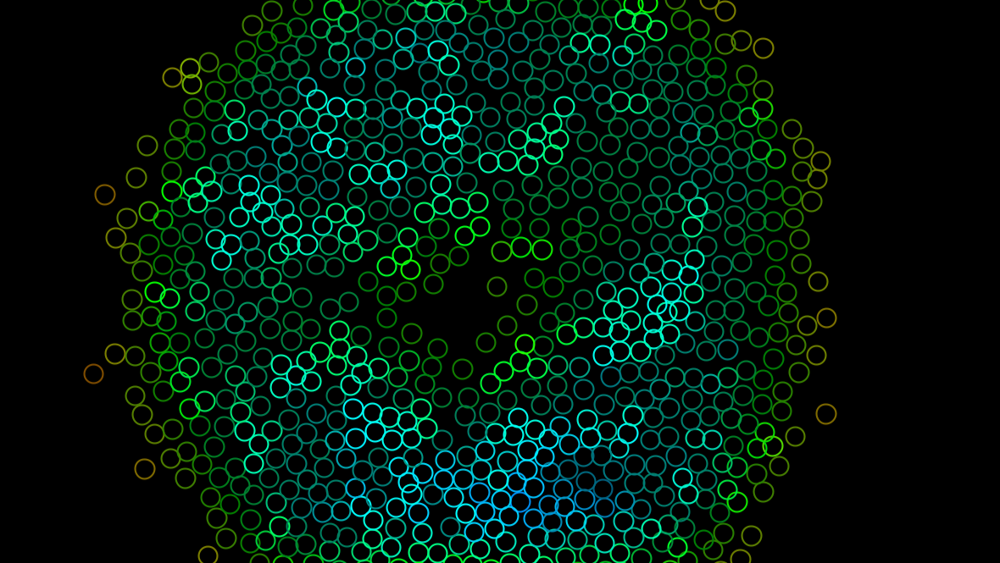
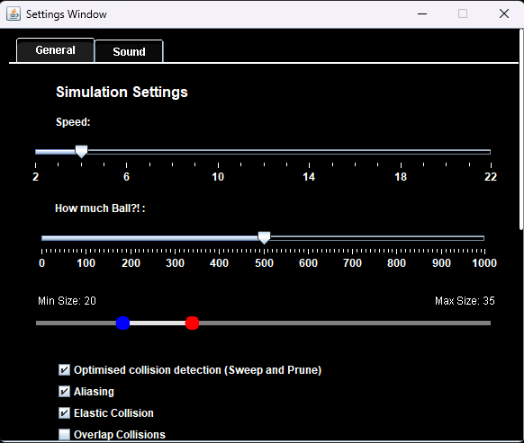
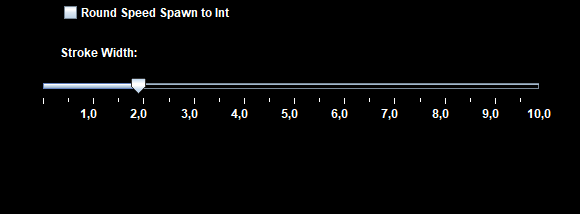
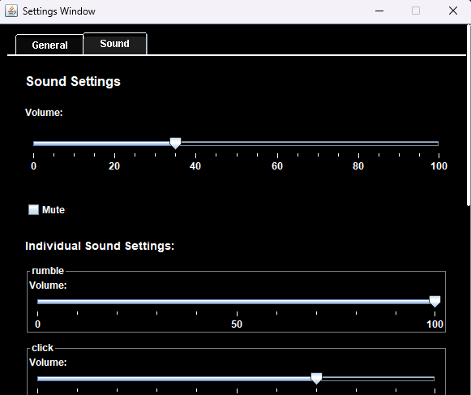
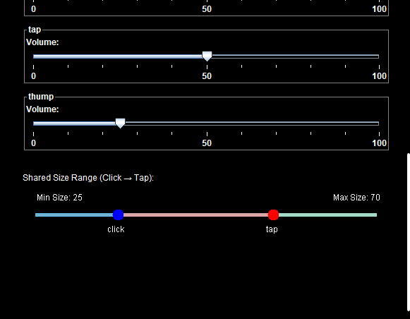

# JavaBalls

A **simple elastic collision simulation** written in Java.

  

---

## How It Works

- Balls **change color** based on **density**  
  → Higher density = shifts toward **red**
  
- Balls **brighten** with more **collisions**

- A built-in **settings menu** allows customization of:
  - Ball properties (e.g., size, speed, density)
  - Collision calculation methods

   
  

   
  

---

## Key Shortcuts

| Key        | Action                              |
|------------|-------------------------------------|
| `R`        | Reset / clear all balls             |
| `Esc`      | Open or close settings menu         |
| `Space`    | Toggle settings / change window focus |

---

> *This program started as a **college project** that I’ve since **heavily modified and expanded**.*

