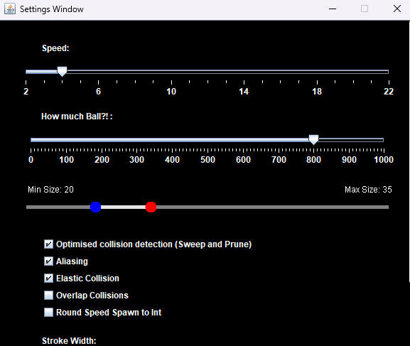
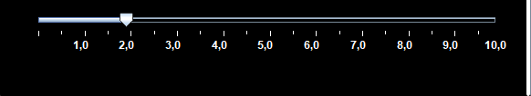

# JavaBalls
a simple elastic collision program

Balls change color based on density (shifting towards red when the density is high) and brightness based on collision amount.

Program also has a settings menu implemented, where you can change properties of balls and methods used to calculate collisions.

\

--------
key shortcuts

R - resets/clears balls

esc - open/close settings menu

space - open settings menu/change window focus
