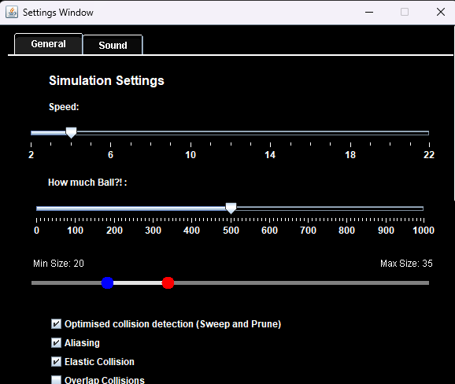
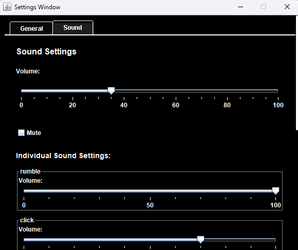

# JavaBalls

A **simple elastic collision simulation** written in Java.

  

---

## How It Works

- Balls **change color** based on **density**  
  → Higher density = shifts toward **red**

- Balls **brighten** with more **collisions**

- Balls **emit sounds** upon collision  
  → Sound properties depend on ball **size, speed, density and number of collisions**  
  → **High-density** collisions are **muffled**

- A built-in **settings menu** allows customization of:
  - Ball properties (e.g., size, speed, density)
  - Collision calculation methods  
  - **Sound settings** (volume, mute, sound types thresholds)

   
  

   
  

---

## Key Shortcuts

| Key        | Action                                |
|------------|---------------------------------------|
| `R`        | Reset / clear all balls               |
| `Esc`      | Open or close settings menu           |
| `Space`    | Toggle settings / change window focus |
| `1`        | Change tab to simulation settings     |
| `2`        | Change tab to sound settings          |

---

> *This program started as a **college project** that I’ve since **heavily modified and expanded**.*

